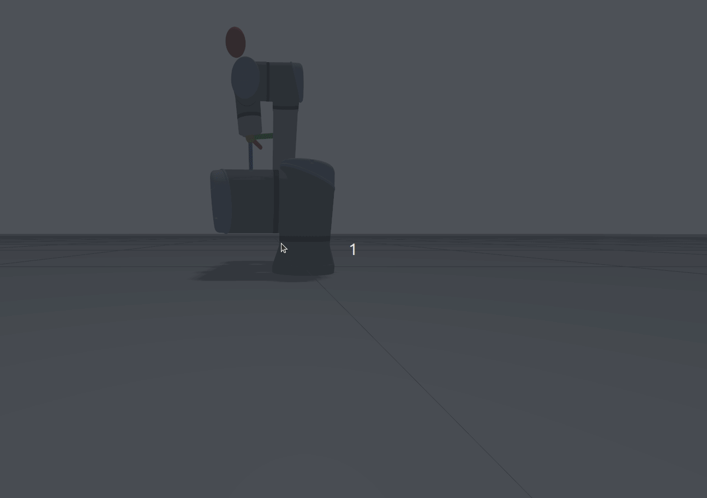

# bug2：到达后末端抖动，且日志未打印到达成功的标志



## 末端到达的判定条件

- 位置误差的欧式距离在0.01m以内
- 姿态误差在0.05rad以内
- clearance > d_min
- 以上三个同时达到
- 到达后会打印日志：tool0 reached target_pose

## 控制链路

```
APF 算速度 → 积分成关节目标 → 发布 trajectory
    ↓
computed_torque 追目标 → 出力矩
    ↓
Gazebo 物理 → /joint_states
    ↓
APF 用 joint_states 做 FK → 再算 _at_goal
```

问题出现在这个链路中

## 先写个临时脚本，测一下这个过程的pos_err ori_err

```
[apf_node-7] [INFO] [1790352191.566680240] [apf_node]: clearance 0.568 m, speed 0.040 m/s, pos_err 0.8332 m, ori_err 1.0555 rad
[apf_node-7] [INFO] [1790352193.570430928] [apf_node]: clearance 0.494 m, speed 0.040 m/s, pos_err 0.7589 m, ori_err 0.6913 rad
[apf_node-7] [INFO] [1790352195.571565644] [apf_node]: clearance 0.394 m, speed 0.040 m/s, pos_err 0.6496 m, ori_err 0.4100 rad
[apf_node-7] [INFO] [1790352197.576198133] [apf_node]: clearance 0.323 m, speed 0.040 m/s, pos_err 0.5118 m, ori_err 0.2508 rad
[apf_node-7] [INFO] [1790352199.577741322] [apf_node]: clearance 0.201 m, speed 0.040 m/s, pos_err 0.2822 m, ori_err 0.6626 rad
[apf_node-7] [INFO] [1790352201.580938682] [apf_node]: clearance 0.200 m, speed 0.040 m/s, pos_err 0.0491 m, ori_err 0.7926 rad
[apf_node-7] [INFO] [1790352203.583604657] [apf_node]: clearance 0.203 m, speed 0.009 m/s, pos_err 0.0088 m, ori_err 0.8280 rad
[apf_node-7] [INFO] [1790352205.585361186] [apf_node]: clearance 0.200 m, speed 0.011 m/s, pos_err 0.0112 m, ori_err 0.8672 rad
[apf_node-7] [INFO] [1790352207.586495739] [apf_node]: clearance 0.200 m, speed 0.013 m/s, pos_err 0.0129 m, ori_err 0.8813 rad
[apf_node-7] [INFO] [1790352209.591426932] [apf_node]: clearance 0.199 m, speed 0.014 m/s, pos_err 0.0140 m, ori_err 0.8762 rad
[apf_node-7] [INFO] [1790352211.592434518] [apf_node]: clearance 0.199 m, speed 0.013 m/s, pos_err 0.0132 m, ori_err 0.8729 rad
[apf_node-7] [INFO] [1790352213.595386590] [apf_node]: clearance 0.199 m, speed 0.013 m/s, pos_err 0.0129 m, ori_err 0.8944 rad
[apf_node-7] [INFO] [1790352215.596648446] [apf_node]: clearance 0.199 m, speed 0.014 m/s, pos_err 0.0135 m, ori_err 0.9580 rad
[apf_node-7] [INFO] [1790352217.604488528] [apf_node]: clearance 0.199 m, speed 0.014 m/s, pos_err 0.0138 m, ori_err 0.9759 rad
[apf_node-7] [INFO] [1790352219.617917822] [apf_node]: clearance 0.200 m, speed 0.013 m/s, pos_err 0.0129 m, ori_err 0.9854 rad
```

说明阈值可能设置大了，调参

```
position_tolerance: 0.02
orientation_tolerance: 2.0
```

```
[apf_node-7] [INFO] [1790352465.198245234] [apf_node]: clearance 0.388 m, speed 0.040 m/s, pos_err 0.6543 m, ori_err 0.5658 rad
[apf_node-7] [INFO] [1790352467.216210603] [apf_node]: clearance 0.299 m, speed 0.040 m/s, pos_err 0.5268 m, ori_err 0.2808 rad
[apf_node-7] [INFO] [1790352469.231524764] [apf_node]: clearance 0.197 m, speed 0.040 m/s, pos_err 0.2884 m, ori_err 0.3190 rad
[apf_node-7] [INFO] [1790352470.434919425] [apf_node]: tool0 reached target_pose
```

到达了，但是仍然抖

姿态差很多，先排查

```
position_tolerance: 0.02
orientation_tolerance: 0.05
```

```
[apf_node-7] [INFO] [1790353194.779083538] [apf_node]: clearance 0.208 m, speed 0.004 m/s, pos_err 0.0043 m, ori_err 0.7310 rad
[apf_node-7] [INFO] [1790353196.796631449] [apf_node]: clearance 0.208 m, speed 0.004 m/s, pos_err 0.0039 m, ori_err 0.6883 rad
[apf_node-7] [INFO] [1790353198.814875835] [apf_node]: clearance 0.208 m, speed 0.004 m/s, pos_err 0.0039 m, ori_err 0.6870 rad
[apf_node-7] [INFO] [1790353200.830622221] [apf_node]: clearance 0.208 m, speed 0.004 m/s, pos_err 0.0038 m, ori_err 0.6906 rad
[apf_node-7] [INFO] [1790353202.843094355] [apf_node]: clearance 0.208 m, speed 0.004 m/s, pos_err 0.0045 m, ori_err 0.7180 rad
[apf_node-7] [INFO] [1790353204.860554517] [apf_node]: clearance 0.208 m, speed 0.004 m/s, pos_err 0.0040 m, ori_err 0.7032 rad
[apf_node-7] [INFO] [1790353206.875562510] [apf_node]: clearance 0.208 m, speed 0.004 m/s, pos_err 0.0040 m, ori_err 0.7051 rad
[apf_node-7] [INFO] [1790353208.888164418] [apf_node]: clearance 0.208 m, speed 0.004 m/s, pos_err 0.0039 m, ori_err 0.7143 rad
[apf_node-7] [INFO] [1790353210.906141629] [apf_node]: clearance 0.208 m, speed 0.004 m/s, pos_err 0.0040 m, ori_err 0.7362 rad
```

姿态误差很大

```
ros2 topic echo /joint_states
```

```
---
layout:
  dim: []
  data_offset: 0
data:
- 2.1274263103338624
- -57.5258498973936
- 4.960932357103345
- -3.801421208652768
- -33.52453819012
- 27.94793360116424
---
layout:
  dim: []
  data_offset: 0
data:
- -1.7837482612554998
- -57.74181305444597
- 4.247778285749648
- -3.232348920495294
- 30.127698466077653
- -36.14065402535397
---
layout:
  dim: []
  data_offset: 0
data:
- -1.921827041130114
- -57.774437444582766
- 4.2172502440933775
- -3.1403399314192546
- 31.378808659577803
- -37.3972712741204
---
layout:
  dim: []
  data_offset: 0
data:
- 1.8243402639920234
- -57.60881971519551
- 4.912839581290981
- -3.32828853513045
- -30.974258349309743
- 25.434548333974405
---
layout:
  dim: []
  data_offset: 0
data:
- 1.9530185703385718
- -57.58589165432774
- 4.942793345777833
- -3.487327462269539
- -32.225289168360305
- 26.69122190544503
---
layout:
  dim: []
  data_offset: 0
data:
- 1.9530185703385718
- -57.58589165432774
- 4.942793345777833
- -3.487327462269539
- -32.225289168360305
- 26.69122190544503
---
layout:
  dim: []
  data_offset: 0
data:
- -1.9504879307790102
- -57.7885278898079
- 4.21840314760588
- -3.086935952931963
- 31.400686703632818
- -37.39726121842175
---
layout:
  dim: []
  data_offset: 0
data:
- -2.088789040020336
- -57.80654896143604
- 4.177492342167103
- -3.0595700357760194
- 32.651773791972396
- -38.65389652525529
---
layout:
  dim: []
  data_offset: 0
data:
- -2.229352911745214
- -57.82509290292258
- 4.13546005857313
- -3.0315157744153565
- 33.90286119475981
- -39.91053177852054
---
layout:
  dim: []
  data_offset: 0
data:
- 2.567508548393085
- -57.40530616370623
- 4.8646308602166295
- -3.618861669611235
- -37.130257422006636
- 33.078350578755234
---
```

wrist2 wrist3的正负在来回变！

## 控制链

```
APF：位置误差已很小 → 仍有大 ori_err → field_command 还在发角速度
  → integrate 主要动 wrist_2/3
  → 50 Hz 发新 trajectory（你抓到了）
  → computed_torque 差分估 qdot_des → wrist 力矩来回翻
  → joint_states 腕部速度/角度跳 → 抖
```

猜测问题出在差分估计期望速度，用前后的位置误差/hz（0.02），导致算出来的速度被放大，但位置误差本身有微小的正负抖动，导致速度，力矩也是翻转

用apf算末端速度然后雅可比映射到关节，姿态误差仍然大

### apf发的速度（期望速度）

```
velocities:
- 0.0009306207889165936
- 0.004157026912157413
- -2.868969457336945e-05
- 0.0028071167809706754
- -0.011038355695021096
- -0.2983025200727013
```


### gazebo报的速度（实际速度）

```
velocity:
- -0.05280610341291854
- -0.005793206604236616
- -0.012700767814757572
- 0.10000388718372298
- 3.141592657822155
- 3.1415926832415053
```

3.14的速度说明gazebo报了假数据

```
tau = k*（q_dot_des-q_dot）
0.11-3.14 0.11+3.14 导致最后wrist23的力矩方向来回翻转
```

另外姿态的误差太大，说明机械臂是在错误的构型上进行修正

q_dot不从gazebo读，而是自己做差分

观察构型，可能处于限位和奇异

加入关节限位势场，到达的构型正常了很多，但还是抖

限位和奇异推开了，抖还在，说明主因不在构型。下面按排除顺序往下查。

## 1. 到达判定有没有写错

位置已经在 1 cm 内，姿态卡在 0.7–1.0 rad。把姿态阈值放到 2.0，日志能打出到达，末端仍抖。

所以：判定没写错。是姿态没跟上，三个条件凑不齐。

## 2. ±π 是不是根因

同一时刻 APF 给 wrist3 大约 -0.3 rad/s，Gazebo 报 ±π。

力矩里有一项 Kd * (期望速度 - 实测速度)。Kd=10 时大约 ±30 N·m，腕会翻号。

q_dot 改成自己对位置做差分后，±π 不再进控制器。腕还是在抽，力矩还是翻。

所以：±π 是抖的时候 Gazebo 报错的速度，不是抖的原因。差分只是不再用这份假数据。

## 3. 势场有没有算错

不经过力矩，只把 APF 的速度一步步积到关节上，姿态误差能往下走。

所以：该怎么转，势场是对的。转不动、还在抖，出在力矩这一环跟不住。

## 4. 为什么只有腕在抖

每个关节“有多沉”，看惯量矩阵对角线上的数。UR16e 大概是：

肩几 kg·m²，肘大约 1，wrist2 大约 0.01，wrist3 大约 0.00084。

腕 3 后面几乎只有一小块，所以那一格特别小。

原来力矩是：

```
tau = g + C + Kp * 位置差 + Kd * 速度差
```

后面两项没有乘“有多沉”。肩很沉，同样大小的 Kd 转不动它；腕很轻，同样的 Kd 一下就抽飞。

控制器 500 Hz，一步 0.002 s。只看速度这一项：

```
下一步速度变化 ≈ (Kd * 0.002 / 这个关节有多沉) * 速度差
```

Kd=10 时：

- wrist3：10 * 0.002 / 0.00084 ≈ 24 → 每步放大二十多倍，并且换方向
- wrist2：大约 2 → 刚好不稳定
- 肩肘：远小于 2 → 稳

这和日志里只有 wrist2 / wrist3 翻号对得上。

## 5. 改法

先算“希望怎么加速”，再按每个关节有多沉出力：

```
tau = g + C + M * (Kp * 位置差 + Kd * 速度差)
```

M 就是上面那个 6×6。每个周期用当前关节角，从 URDF 里各连杆的质量和转动惯量算出来，姿势变它就变。

这样 Kd=10 在 2 ms 里只相当于 0.02，腕和肩都不会被一步打反。