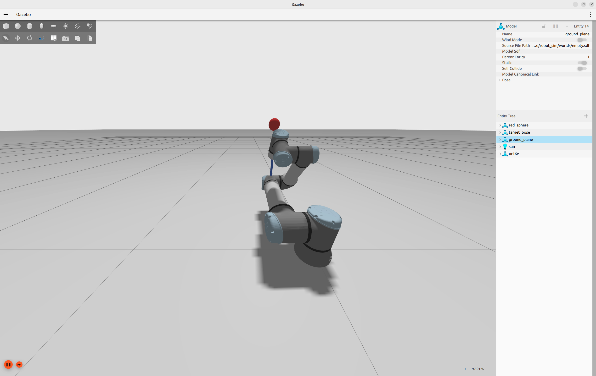

# bug3：连杆碰到障碍物，但仍然发速度

```
[apf_node-7] [INFO] [1790422371.045641414] [apf_node]: tool 0.159 m, link 0.031 m, self 0.029 m, speed 0.040 m/s, pos_err 0.1421 m, ori_err 0.6109 rad
[apf_node-7] [INFO] [1790422373.046010620] [apf_node]: tool 0.159 m, link 0.031 m, self 0.029 m, speed 0.040 m/s, pos_err 0.1468 m, ori_err 0.6344 rad
[apf_node-7] [INFO] [1790422375.054318414] [apf_node]: tool 0.159 m, link 0.031 m, self 0.029 m, speed 0.040 m/s, pos_err 0.1494 m, ori_err 0.6459 rad
[apf_node-7] [INFO] [1790422377.071611218] [apf_node]: tool 0.158 m, link 0.031 m, self 0.029 m, speed 0.040 m/s, pos_err 0.1510 m, ori_err 0.6534 rad
[apf_node-7] [INFO] [1790422379.071660043] [apf_node]: tool 0.158 m, link 0.031 m, self 0.029 m, speed 0.040 m/s, pos_err 0.1521 m, ori_err 0.6583 rad
[apf_node-7] [INFO] [1790422381.073775890] [apf_node]: tool 0.158 m, link 0.031 m, self 0.029 m, speed 0.040 m/s, pos_err 0.1529 m, ori_err 0.6617 rad
[apf_node-7] [INFO] [1790422383.073835896] [apf_node]: tool 0.158 m, link 0.031 m, self 0.029 m, speed 0.040 m/s, pos_err 0.1534 m, ori_err 0.6640 rad
```



tool 那一列 0.158，看着很安全，但连杆已经贴到红球了，还在以 0.040 m/s 发速度，pos_err 反而越走越大（0.1421→0.1534）。

## 碰撞的判定条件（修之前）

- 急停只看 tool0 点到障碍物的最短距离 `< d_min`
- 0.158 代表 tool0 到小球末端的最近距离，`> d_min`，导致没有触发急停

## 排查过程

tool0 数值计算方式：

```
d = ‖tool0 位置 − 球心‖ − 球半径 R
```

发现 tool0 的定义是一个点，不能用点的距离差来判断是否碰撞。

## 结论

停止的判断对象出了问题，不应该是 tool0 点而应该是 link。

## 改法

### 1. link 才是碰撞的判断对象

连杆是一段胶囊，不是点。判断方式：

```
gap = ‖连杆中心线到球心最近点 − 球心‖ − 球半径 R − link半径
```

急停不看球面，看球的 AABB 盒：

```
stop_gap = 连杆中心线到 AABB 盒最短距离 − link半径
stop_gap <= d_min → 停
```

为什么急停用盒而不用球面：一步走 `v_max * horizon = 4mm`，离散步进会跨过球面。实测 `d_min=0` 时 4 个 case 都是先穿透（`min_link` 为负）再停。改成 `d_min=0.02` 后 100 个 case 零穿透，停的时候 `min_link` 留 0.018~0.020。

### 2. tool0 点的 hold 要补回来

之前 `if avoidance.hold` 把 `command.hold` 丢了，工具点撞了也不停。现在：

```
if avoidance.hold or command.hold → 停
```

停的原因按谁的余量最小报，不猜：

```
tool余量 = tool clearance − d_min
link余量 = link clearance − d_min
self余量 = self clearance − self_d_min
```

谁最小报谁。

### 3. 自碰撞：只看非相邻连杆

相邻连杆共用一个关节，贴着是正常的，不管。只算非相邻对的胶囊距离：

```
gap < self_d0(0.03) → 推开
gap <= self_d_min(0.005) → 停
```

参数不用调，标定过：正常工作区自间隙恒为 0.04（腕部结构常数），从来碰不到 0.03；大动作 2000 采样下误停 0.3%。开关直接开：

```yaml
self_avoidance: true
```

效果：之前 9 个穿过自己的 case，现在改成 `self_hold` 停住，无障碍复测也一样停，说明从这个起点过去本来就要折穿自己，不是误伤。

### 4. 日志只看 min 一列

```
tool 0.159 m, link 0.031 m, self 0.029 m, min 0.029 m, speed 0.040 m/s, pos_err 0.1421 m, ori_err 0.6109 rad
```

`min` 是三者最小值。只看 `tool` 会被骗（开头那段日志就是例子），以后看 `min` 就够了。

## 验证数据（同种子 100 目标）

```
修前：成功 68%，连杆穿透 4 起，自穿透 9 起
修后：成功 55.6%，穿透 0 起
```

成功率掉的 12 个点全是原来作弊的（穿过去"到达"的）。`timeout` 没变（28→27），那是 APF 自身收敛问题，不在这篇的范围。
